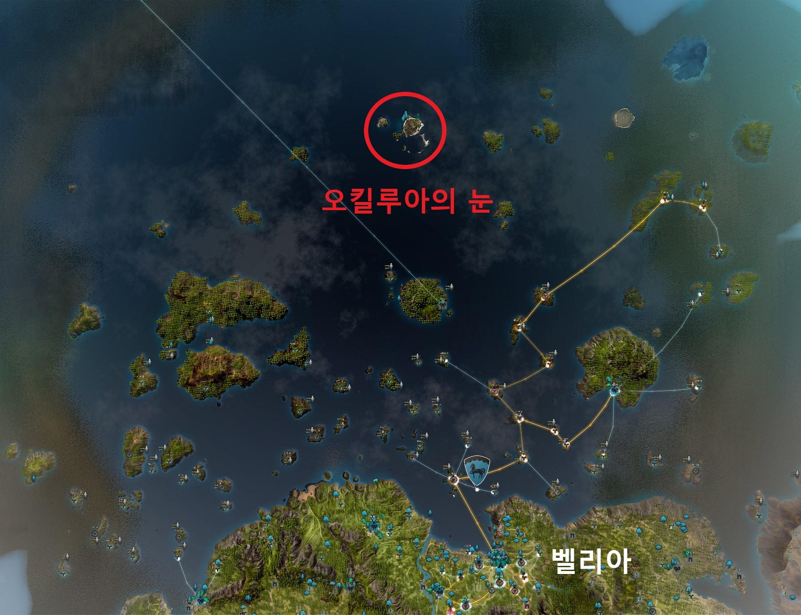
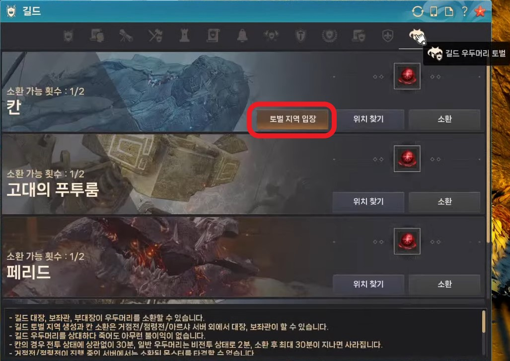
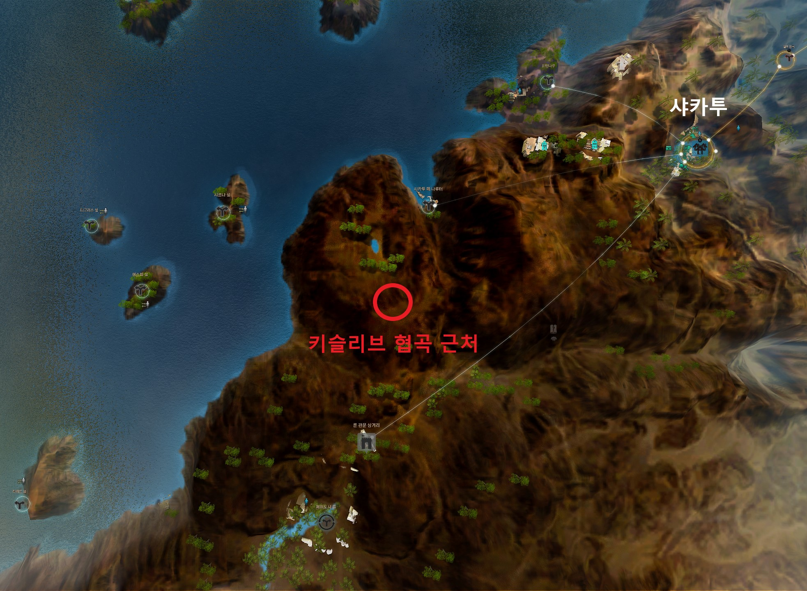
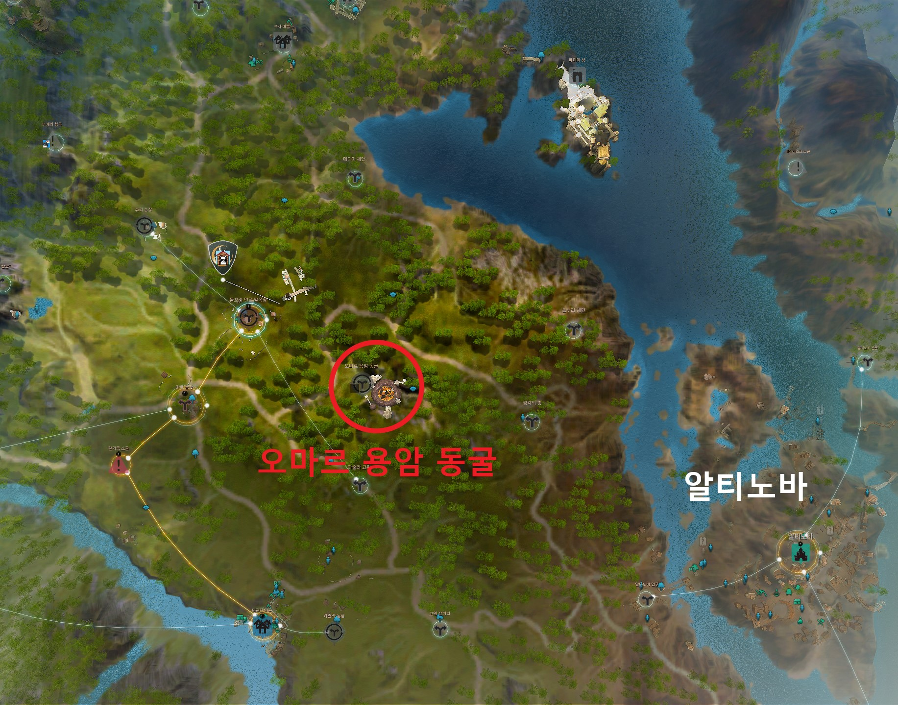
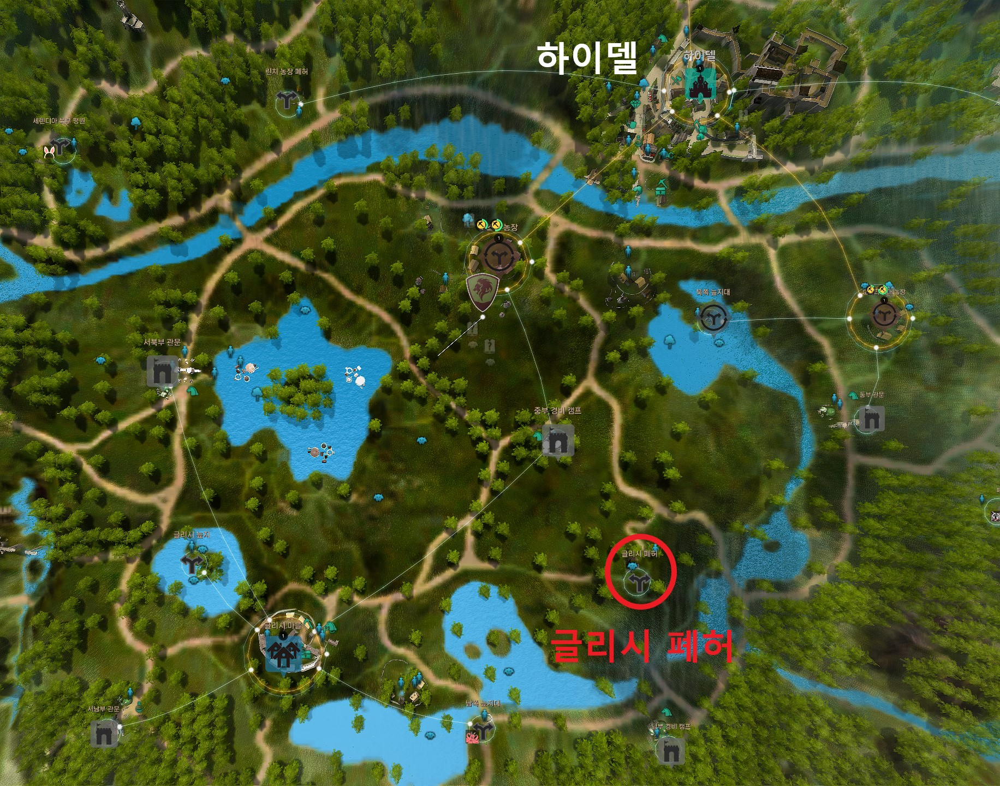

# 길드 우두머리 토벌
> [[모험가 가이드] 길드 소환 우두머리 레이드 | 검은사막](https://www.kr.playblackdesert.com/ko-KR/Wiki?wikiNo=171)

<!-- TODO: 우두머리 토벌 창 이미지 -->
우두머리 토벌을 선택하면 나오는 화면이에요!

우두머리 토벌 화면에서는 각 우두머리를 소환하기위한 소환서 갯수를 확인할 수 있고,\
소환서를 다 모으면 **소환 위치를 확인**할 수 있어요!

육지에서 소환되는 우두머리들은 서로 거리가 꽤 멀기 때문에 말을 챙겨오시는게 좋아요!

:::details 공통 보상
 - **영롱한 광명석** 확정 드랍
 - **금괴** 1KG, 100G, 10G 확률 드랍
:::

:::tip TIP
길드 우두머리 레이드는 사망패널티(수정 파괴, 경험치 하락 등)가 없어요!
:::

## 칸
*오킬루아의 눈*
 
*토벌 지역 입장*

칸 레이드는 오킬루아의 눈에 있는 호수에서 진행되며, 우두머리 토벌 메뉴에서 `토벌 지역`에 입장해야 진행할 수 있어요
:::tip TIP
칸 레이드에서는 추가로 **응축된 칸의 마력**(칸의 심장 재료)를 획득할 수 있어요!
:::

## 푸투룸
*키슬리브 협곡 근처*

푸투룸은 샤카투 마을 근처 고원에서 진행해요
:::tip TIP
푸투룸에서는 추가로 **고대 수호자의 유품**(악세 상자)을 획득할 수 있어요!
:::

## 페리드
*오마르 용암 동굴*

페리드는 오마르 용암동굴에서 진행해요

## 진흙괴물
*글리시 폐허*

진흙괴물은 글리시 폐허에서 진행해요
