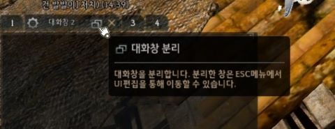
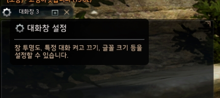
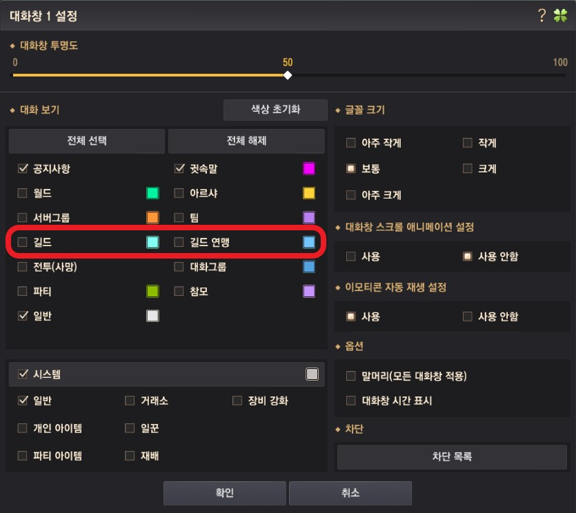

# 채팅창 분리 및 설정
> [[모험가 가이드] 초급 가이드 | 검은사막](https://www.kr.playblackdesert.com/ko-KR/Wiki?wikiNo=6)

채팅창 분리 및 설정을 통해 길드 채팅을 따로 빼두는 방법이에요!

길드 채팅을 분리해두고 사용하면 채팅이 밀리지않아 공지, 집결시간 등 필요한 채팅을 더 쉽게 확인할 수 있어요.

## 채팅창 분리
*대화창 분리 버튼*

채팅창에 커서를 올리면 상단에 나오는 `대화창 분리` 버튼을 통해 채팅창을 최대 5개 까지 분리할 수 있어요!

:::tip TIP
분리한 채팅창은 `UI편집`에서 위치를 옮길 수 있어요
:::

## 채팅창 설정
*대화창 설정 버튼*

각 채팅창에 커서를 올리면 상단에 나오는 `대화창 설정` 버튼을 통해 설정창을 열 수 있어요!

*대화창 설정*

설정창에서는 해당 채팅창에 표시될 채팅을 선택할 수 있어요.\
**환상연화**에서는 `길드`채팅과 `길드 연맹`채팅을 모두 사용하므로 둘 다 활성화 해주세요!
