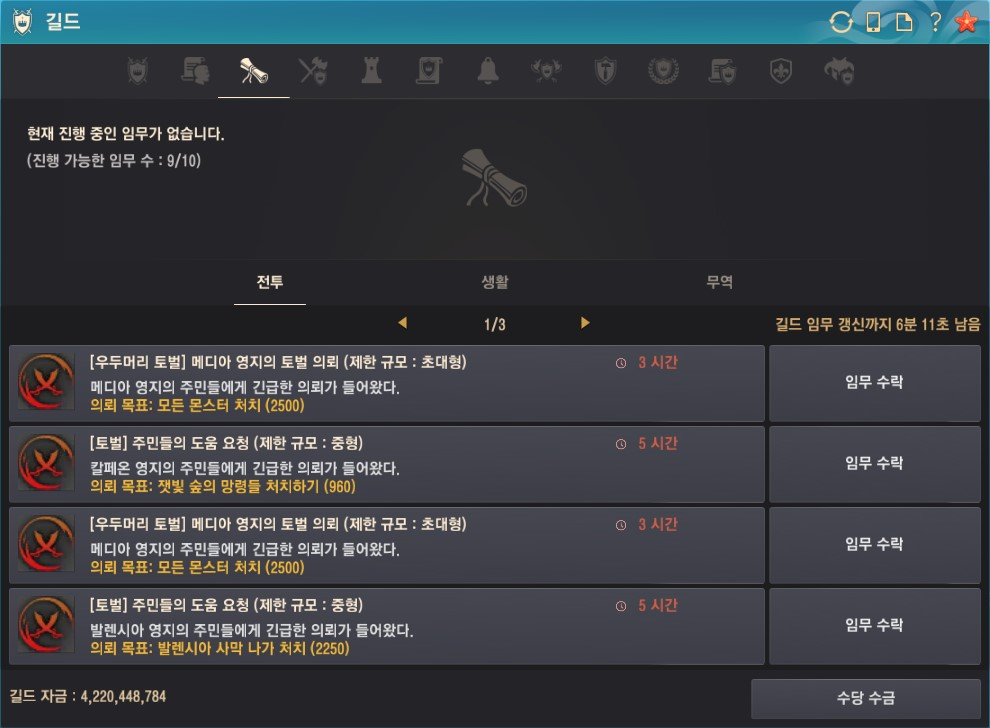

# 길드 임무
*길드 임무 화면*

길드 임무를 선택하면 나오는 화면이에요!

**환상연화**에서는 누구나 길드 임무에 참여할 수 있어요:smile:

길드 임무에 참여하면 길드 활동량을 채울 수 있고, 임무를 완료하면 수당을 받을 수 있어요!

길드 임무는 채널마다 임무 종류와 갱신 시간이 달라요.

길드 임무를 누르면 길드 임무 보상을 포함한 길드 임무 상세정보를 확인할 수 있어요!

:::details 길드 임무 분류
**전투** - 몬스터 사냥\
**생활** - 요리, 낚시, 채집, 연금 등 생활 관련\
**무역** - 특정 물품을 지정된 npc에게 배달
:::

## 임무 수락
길드 임무 수락은 부대장 이상의 길드 간부만 가능하기 때문에 길드 임무를 진행하기 위해서는 원하는 길드 임무를 찾아서 수락해달라고 요청해야합니다.

길드 임무 수락을 요청할때는 **채널, 임무 종류, 갱신까지 남은 시간**을 알려주는게 좋아요!
갱신까지 남은 시간이 짧으면 임무 수락을 위해 이동을 했는데 임무 리스트가 갱신되어버릴 수 있어요:disappointed_relieved:
> 예시) 카마실비아2 사막나가 중형 갱신까지 6분 11초 받아주세요! 

 

:::tip 참고
**[우두머리 토벌]** 임무는 길드 규모에 맞는 임무만 수행할 수 있으며, 길드 우두머리 탭에서 모자란 소환서 조각을 확인하고 진행하는게 좋습니다.
:::
:::warning 주의
한 채널에서 동시에 여러개의 길드 임무를 수락할 수 없습니다.
:::

## 임무 진행
길드 임무는 임무를 받은 채널에서만 진행할 수 있으며 누구나 참여할 수 있어요:smile:

길드 임무 진행은 임무를 받은 채널의 엘비아 지역과 마르니의 밀실에서도 가능해요.

길드 임무에 참여하면 해당 임무에 기여한 정도에 따라 길드 활동량과 수당이 적립되요!
이 때 수당은 해당 임무 완료 보상 은화의 50%의 금액이 임무에 기여한 정도에 따라 자동으로 적립되요

:::tip 참고
길드 임무 보상 은화 계산 시 소수점 자리는 버림 되기 때문에 계산 금액과 실제 수령 금액이 상이할 수 있습니다.
:::

## 임무 완료
길드 임무 완료도 임무 수락과 마찬가지로 부대장 이상의 길드 간부만 가능하기 때문에 완료 조건을 달성하면 완료해달라고 요청해야합니다.

길드 임무를 완료하고나면 해당 채널에서는 10분간 길드 임무를 받을 수 없으니 주의해야해요!

## 수당 수금
길드 임무 화면 오른쪽 아래에 있는 `수당 수금`버튼을 통해 적립된 수당을 확인하고 수금할 수 있어요.

적립된 수당은 길드를 탈퇴할 때까지 누적되지만 큰 금액을 한꺼번에 수금하게 되면 길드 자금 운용에 차질이 생길 수 있으니 임무가 완료되면 바로 수금하는게 좋아요!