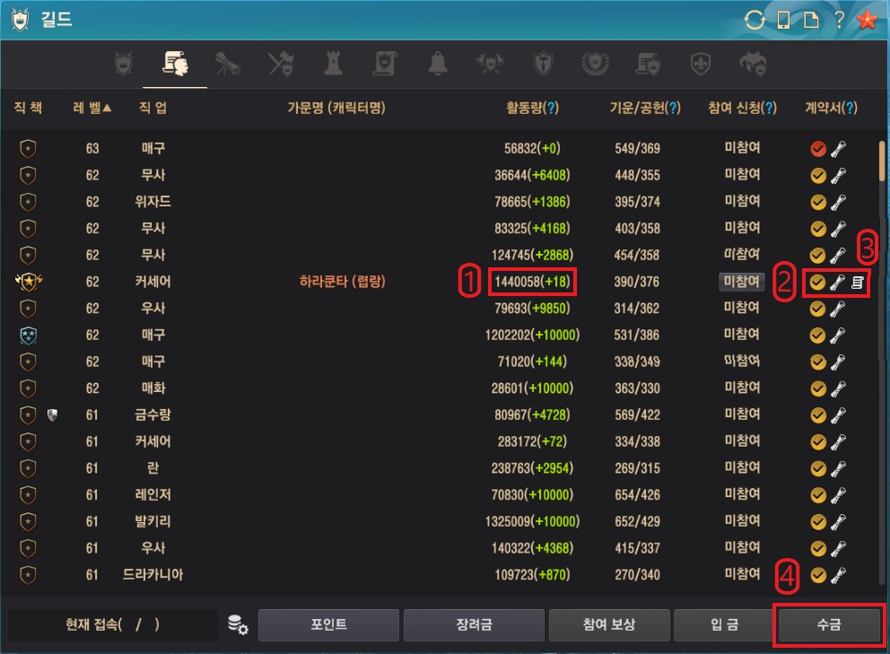

# 길드원 현황
*길드원 현황 화면*
> 길드 대장 기준 화면이라 길드원은 조금 다를 수 있어요

길드원 현황을 선택하면 나오는 화면이에요

[1. 길드 활동량](#1-길드-활동량)\
[2. 길드 계약서](#2-길드-계약서)\
[3. 길드 포인트](#3-길드-포인트)\
[4. 길드 일일 급여](#4-길드-일일-급여)

## 1. 길드 활동량
길드 활동량은 보통 길드 임무 수행으로 채우지 캐릭터 레벨업이나 생활 컨텐츠 레벨업으로도 활동량을 채울 수 있어요!\
이제 막 검은사막을 시작한 뉴비분들도 열심히 레벨업하면서 생활컨텐츠도 조금씩 건들다보면 금방 채울 수 있어요:smile:

길드 활동량은 `누적 활동량(+현재 활동량)`으로 표시되며, 현재 활동량은 최대 10,000점까지 쌓을수 있어요! 현재 활동량이 최대치가 되었을때는 계약 갱신을 진행하면 현재 활동량이 초기화되요

길드 활동량은 재계약 시 일급 상승폭에 영향을 주기 때문에 **일급 MAX**를 노린다면 길드 가입 초기에는 신경써주는게 좋아요
:::details 일급 상승폭
재계약 시 현재 활동량 100점당 현재 임금의 1%를 상승시킬 수 있으며\
계약 금액의 증가 폭은 계약 1회당 100%로 제한됩니다.
:::

:::tip TIP
현재 활동량이 10,000점이 되어도 누적 활동량은 계속 쌓여요!
:::

## 2. 길드 계약서
계약서 항목의 check circle 아이콘에서는 길드 계약 관련 정보를 확인할 수 있어요!

아이콘에 마우스를 올리면 현재 접속 서버, 최근 접속 시간, 활동비 잔액을 확인할 수 있고\
아이콘을 누르면 **일일 급여**와 **계약 기간**을 확인할 수 있어요

계약 상태는 check circle 아이콘 색깔에 따라 3가지로 분류되요
> :red_circle: 빨강: 재계약 불가(신규 가입/재계약 후 24시간이 지나지 않음)\
> :yellow_circle: 노랑: 재계약 가능\
> :large_blue_circle: 파랑: 계약기간 만료

아이콘 색깔이 파란색이면 길드 패시브 버프, 엑티브 스킬(집결, 버프) 효과도 받을 수 없어요!\
계약기간 만료가 얼마 안남았거나 만료된 상태라면 빠르게 부대장급 이상 간부에게 재계약 요청 해주세요

**환상연화**에서는 30일 단위로 재계약을 진행해요!

## 3. 길드 기여도(포인트)
길드 기여도 시스템은

[2023년 1월 11일 패치노트](https://www.kr.playblackdesert.com/ko-KR/News/Detail?groupContentNo=9629&countryType=ko-KR)

## 4. 길드 일일 급여