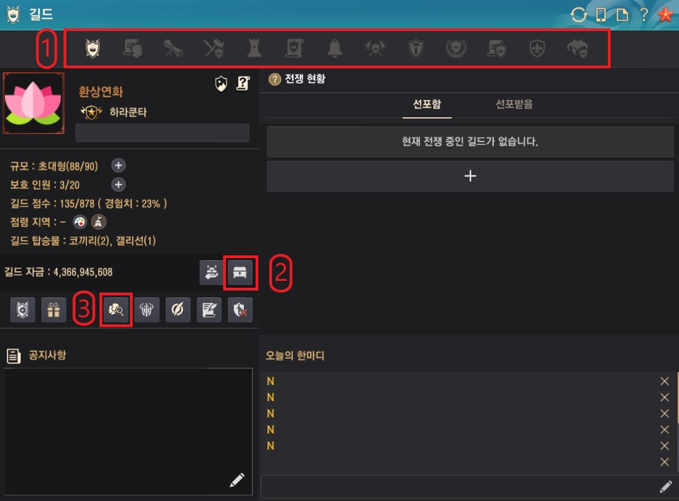
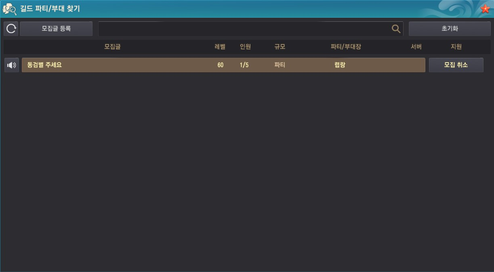

# 길드 화면
*길드 메인 화면*
> 길드 대장 기준 화면이라 길드원은 조금 다를 수 있어요

길드창을 열면 가장 먼저 나오는 화면이에요\
길드 관련 시스템은 대부분 길드창(G)에서 이용할 수 있어요

[1. 길드 메뉴](#_1-길드-메뉴)\
[2. 길드 창고](#_2-길드-창고)\
[3. 길드 파티/부대 찾기](#_3-길드-파티-부대-찾기)

## 1. 길드 메뉴
길드 메뉴들이에요 왼쪽부터 순서대로 나열했어요!!
보통은 <Badge type="tip" text="사용" vertical="middle"/> 표시가 된 메뉴를 자주 사용해요
 - 길드 정보 <Badge type="tip" text="사용" vertical="middle"/>
 - 길드원 현황 <Badge type="tip" text="사용" vertical="middle"/>
 - 길드 임무 <Badge type="tip" text="사용" vertical="middle"/>
 - 길드 기술
 - 거점전/점령전 현황
 - 길드 연혁
 - 길드원 모집
 - 길드 결전
 - 길드 제작
 - 길드 연맹
 - 연맹원 현황
 - 전장의 영웅
 - 길드 우두머리 토벌 <Badge type="tip" text="사용" vertical="middle"/>

## 2. 길드 창고
길드 창고는 길드원들이 다같이 사용하는 창고이며, 아이템마다 넣고 빼기가 가능한 직급이 정해져있어요
아이템들 중 `[길드]`라고 적힌 아이템들은 개인 창고에 보관할 수 없고 길드창고에만 넣을수 있어요

## 3. 길드 파티/부대 찾기
*길드 파티/부대 찾기 화면*\
길드 내 파티/부대 찾기 기능이에요!\
이 기능을 사용하면 길드원들을 대상으로 파티/부대를 만들고 지원할 수 있어요!\
광고 기능을 사용하면 길드채팅에 모집 광고가 올라가고, 채팅을 누르면 지원할 수 있어요!

