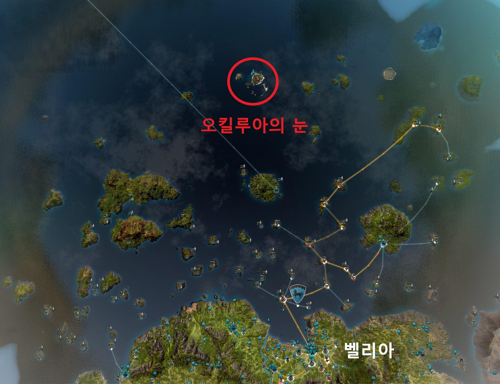
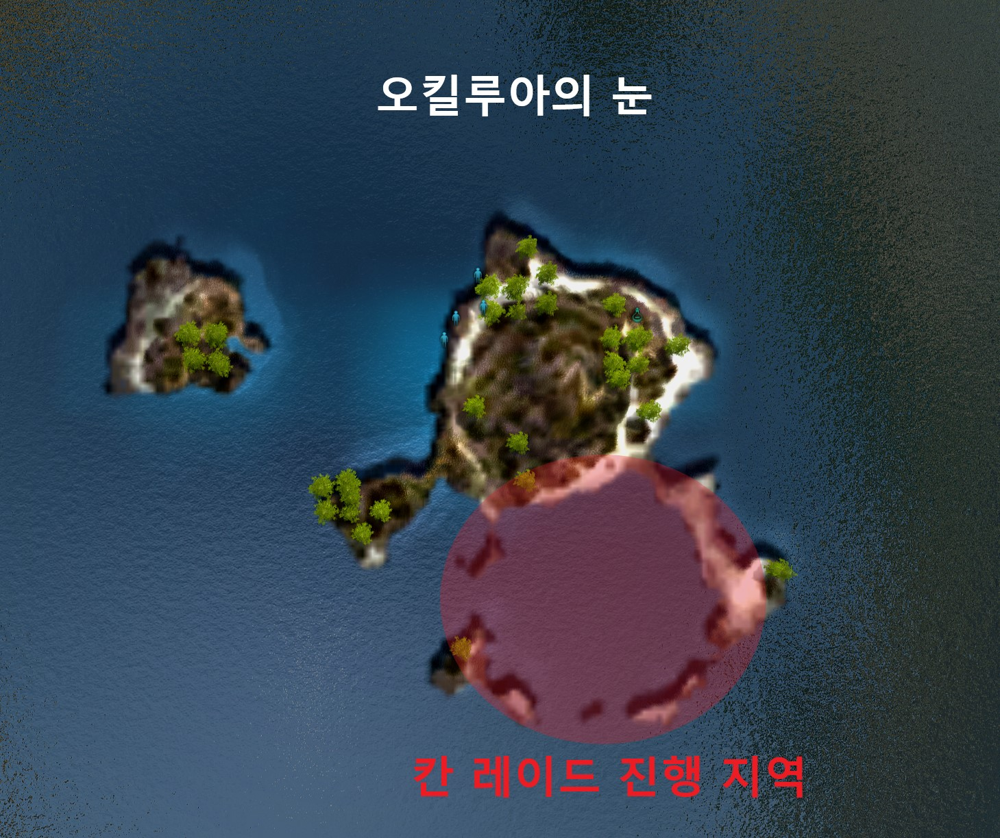

# 칸 레이드
## 위치
*오킬루아의 눈*
 
*칸 레이드 진행 지역*

칸 레이드는 오킬루아의 눈 섬에 있는 동그란 호수에서 진행해요!
## 준비물
칸 레이드를 진행하기 위해서는 괴수잡이 대포, 괴수잡이 포탄, 흑결정 포탄이 필요해요!

## 진행
### 1. 토벌 지역 입장
### 2. 대포 설치
### 3. 포탄 넣기
### 4. 발사
### 5. 광역 공격
## 해초조
